 

## About

I'm an AI engineer focused on building machine learning systems end to end: data preparation, feature engineering, model training and evaluation, and turning results into tools people can use.

## Focus Areas

| Area | What I work on |
| --- | --- |
| **Machine Learning** | Classification, ensemble methods, model evaluation and tuning |
| **Data Engineering for ML** | Cleaning, preprocessing, feature pipelines |
| **Applied AI** | Predictive systems for real business problems |
| **Software Foundations** | Algorithms, data structures, clean and maintainable code |

## Tech Stack

  

## Featured Project

### [smart-recruitment-assistant](https://github.com/yumnasaber/smart-recruitment-assistant)
ML-powered recruitment assistant that predicts candidate job-change likelihood.

- **Models:** Random Forest, Logistic Regression
- **Stack:** Python, Jupyter, scikit-learn
- **Goal:** help recruiters prioritize candidates more effectively

## Contact

